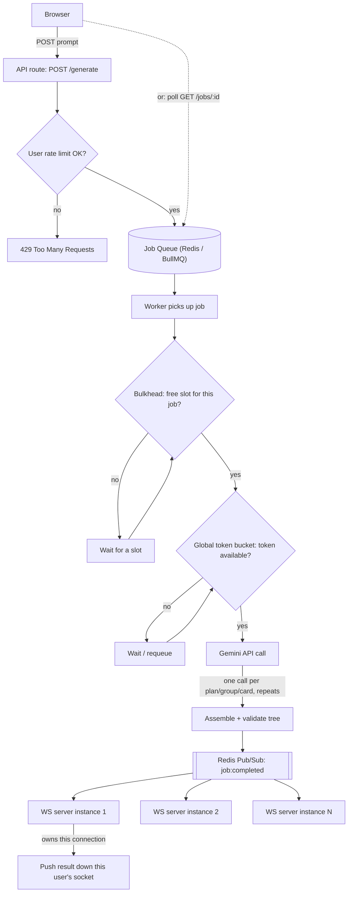

# Uncody — AI Section Generator & Editor

A take-home assignment: a prompt-driven section generator (mock AI + optional real
Gemini integration) that returns a structured JSON tree, a generic renderer that
turns that tree into UI without any per-layout components, click-to-edit inline
editing, and mock persistence.

See [ARCHITECTURE.md](./ARCHITECTURE.md) for the full technical writeup and
`docs/` for deep-dive notes on specific problems.

## 1. Local setup

**Requirements:** Node.js ≥ 20.9 (Next.js 16 requires it).

```bash
npm install
npm run dev
```

Open [http://localhost:3000](http://localhost:3000). By default the app runs
entirely on the **mock backend** — no API key or network calls needed to try
the core assignment (prompt → layout → edit → save).

### Enabling real AI generation (optional, extended scope)

Copy the example env file and add a Gemini API key:

```bash
cp .env.example .env.local
```

```
GEMINI_API_KEY=your-key-here
GEMINI_MODEL=gemini-2.5-flash   # optional override, this is the default
```

Get a key from [Google AI Studio](https://aistudio.google.com/apikey). Restart
the dev server after adding the key.

In the UI, check **"Use real AI (Gemini)"** before hitting Generate. If the key
is missing or every Gemini call fails, the request **falls back to the mock
backend automatically** rather than erroring — the response includes which
mode actually ran (`usedMode: "real" | "mock"`) plus a `fallbackReason` when it
fell back, so this is visible rather than silent.

| | Mock mode | Real AI mode |
|---|---|---|
| Cost / speed | Instant, free | ~2-6s, several Gemini calls per generation |
| Coverage | 2 predefined layouts (hero, pricing), matched by keyword | Any prompt, generated structure |
| Reliability | Deterministic, always succeeds | Can fail after retries — falls back to mock |
| Required for grading the base assignment | Yes | No — purely additive |

## 2. Core assignment scope

This is what the assignment specifically asked for.

### Data model: a generic JSON tree, not per-layout markup

Every section is one `SectionNode` — a discriminated union (`container`,
`heading`, `paragraph`, `button`, `list`, `listItem`, `badge`), each with an
`id`, a `type`, optional styling `props` drawn from small closed enums
(`tone`, `align`, `weight`, `variant`, ...), and `container`/`list` nodes
additionally holding `children: SectionNode[]`. TypeScript enforces this at
compile time; a mirrored `zod` schema (`schema.ts`) enforces the same shape
at runtime, since the backend response and any saved payload are untrusted
input that TypeScript's compile-time types can't protect against.

- **Benefit:** the backend can never hand the frontend "some HTML" — only
  a small set of node types the renderer already knows how to draw. New
  layouts are new *data*, never new *components*.
- **Tradeoff:** styling is limited to the enum values we defined up front
  (e.g. 4 tones, not arbitrary colors). We chose this deliberately — see
  "closed vocabulary" in ARCHITECTURE.md — because it's what makes the
  tree safe to both generate and render generically, at the cost of some
  visual variety.

### Mock backend: keyword-matched layouts

`generateLayout(prompt)` in `layouts.ts` does simple keyword matching
(e.g. "pricing"/"tier" → `PRICING_LAYOUT`, else → `HERO_LAYOUT`) and returns
one of two predefined `SectionNode` trees. This satisfies the assignment's
"≥2 layouts, matched by keyword" requirement without any real AI call.

- **Benefit:** instant, free, deterministic — good for testing the
  rendering/editing pipeline without depending on an external API.
- **Tradeoff:** only 2 fixed layouts; any prompt not matching a keyword
  still gets *a* layout, just not necessarily a relevant one. This is the
  expected behavior for a mock backend, not a bug.

### Generic rendering: one recursive component, no per-layout code

`Renderer.tsx` is a single recursive component that switches on
`node.type` and renders accordingly, recursing into `children` for
containers/lists. Every visual variation (color, alignment, weight, ...)
comes from looking up the node's `props` enum values in small
Tailwind-class lookup tables — there is no `HeroRenderer` or
`PricingRenderer`; the exact same component draws both layouts, and would
draw any future layout built from the same node types.

- **Benefit:** adding a third layout (mock or AI-generated) requires zero
  frontend code changes, only new data.
- **Tradeoff:** the renderer can only ever draw combinations of props it
  already has lookup entries for — extending the visual vocabulary means
  touching both the schema and the renderer's lookup tables together.

### Click-to-edit inline editing

Text nodes render their text inside a `contentEditable` wrapper. Edits
commit to React state only on **blur**, not per-keystroke — committing
per-keystroke caused the cursor to jump to the start of the text on every
render (a real bug we hit and fixed this way). `updateNodeText`/
`updateNodeProps` (`updateTree.ts`) do an **immutable** recursive update:
they rebuild only the path from the root down to the edited node, reusing
every untouched sibling node by reference (structural sharing), rather
than deep-cloning the whole tree on every keystroke-to-blur edit.

- **Benefit:** cheap re-renders (React can bail out of re-rendering
  subtrees that are reference-equal to the previous render), and a simple
  mental model — one edit, one new tree, old tree untouched.
- **Tradeoff:** every edit path requires care to preserve immutability
  correctly (easy to accidentally mutate in place); we added a "did
  anything actually change" check so an edit that doesn't change a node
  doesn't still produce a new tree reference for every ancestor.

### Mock persistence

`POST /api/save` validates the incoming tree with
`SectionNodeSchema.safeParse` (rejecting malformed payloads — verified via
`curl` that a garbage `type` value was silently accepted before this
check existed) and stores it in a single in-memory variable (`store.ts`).
`GET /api/save` reads it back. No real database, per the assignment's
"mock persistence" requirement.

- **Tradeoff:** state is lost on server restart and isn't shared across
  server instances — acceptable for a take-home mock, called out
  explicitly as a known limitation rather than hidden.

## 3. (Optional) Real AI integration — how the architecture evolved

The assignment only required a mock backend. We built a real Gemini
integration on top of it, purely additively (see the mock/real toggle in
Section 1), to explore what a production structured-output AI pipeline
actually has to handle — none of this is required for the base assignment
to work or be graded. This section tells the story in the order we
actually hit it, not just the final design.

### Attempt 1: ask the model for the whole JSON tree in one call

The most obvious approach: send Gemini the full recursive `SectionNode`
schema and ask for one complete tree back in a single response. This
surfaced Gemini's constrained-decoding limits fast, in live testing:

- A recursive `children` array with no cap combinatorially exploded the
  schema → **"too many states for serving."** Fixed by capping `maxItems`
  to a tested-safe `4` in the Gemini-facing schema copy.
- Marking the recursive `children` field `required` (needed for our real
  validation) broke Gemini's cyclic-schema "unrolling" → **"Request
  contains an invalid argument."** Fixed by stripping `children` out of
  `required` in that same Gemini-facing copy only.
- `minItems` combined with `maxItems` on that same recursive array also
  400'd, bisected field-by-field against the live API until isolated to
  that specific combination. Fixed by dropping `minItems` from generation
  (the real schema still enforces it afterward).
- Even past the schema-shape issues, the model would still invent node
  types outside our enum (`"quote"`, `"caption"`) — fixed with an explicit
  prompt rule plus a retry that feeds the exact validation error back.

Once those were patched, one deeper problem remained that no amount of
prompt tweaking fixed: **a section with several independent sub-items in
it (e.g. 3 pricing cards, each needing its own composed content) would
reliably come back with one of those items empty or malformed.** One call
asking a model to independently populate several parallel, unrelated
pieces of structured content just isn't reliable — proven by testing, not
assumed.

### Attempt 2: split into multiple calls — one per independent piece

The fix for that reliability problem: stop asking for everything in one
shot. Decompose into a **plan** call (what should exist) and separate
**generation** calls, one per group and then one per card, run
concurrently. This fixed the reliability problem completely — each call
now only has one, simple thing to produce.

But splitting the calls created a new problem we hadn't had before:
**visual and structural inconsistency across independently-generated
cards.** Because each card's own API call was still deciding its own
tone/weight/button-style, and no call could see what any sibling call
decided, cards in the same section would come back looking like they
belonged to different designs — one bold, one not; one with a button, one
without. Our first instinct was to just override the mismatched styles in
code after generation — but that raised the obvious question: **if we're
going to override whatever styling the AI decides anyway, what was the
point of asking it to decide styling in the first place?** That pushback
is what forced a real architectural fix instead of a patch.

### Attempt 3 (final): decide design once, up front, then split calls only for content

The actual fix: add a dedicated **plan phase** that makes every design
decision **once**, up front, before any content gets generated — a shared
`theme` (tones, weights, button variants) plus the section's structure
(groups, layout, each group's `fields` recipe). Every later call, whether
per-group or per-card, is handed that same `theme` and is only ever asked
for **raw text**, never styling. Our own code (`buildFieldNode`)
deterministically turns that text into styled nodes using the one shared
theme — so consistency is a property of the code path, not something
independent AI calls have to agree on by chance.

Concretely, this is the pipeline a request goes through:

1. **Plan call** — reads the whole prompt, decides heading/subtitle, the
   shared `theme`, and a list of `groups` (each with a `layout`,
   `itemKind`: `"leaf"` or `"card"`, and — for cards — a `fields` recipe).
2. **Per-group calls, concurrently** (`Promise.allSettled`) — `"leaf"`
   groups (simple items like buttons) get one call for the whole group;
   `"card"` groups fan out to...
3. **Per-card calls, concurrently** — one call *per item*, asking only for
   flat text matching that group's `fields` recipe (e.g.
   `{title, meta, body, cta}`, plain strings, no styling at all).

See `docs/pipeline-dry-run-notes.md` for a full worked example tracing
every call, and `docs/gemini-single-call-issues.md` / ARCHITECTURE.md for
exact error messages and JSON from the Attempt 1 failures above.

- **Benefit:** design consistency across a whole generated section is
  guaranteed by the code path, not by hoping independent AI calls happen
  to agree with each other.
- **Tradeoff:** less per-item creative range — every card in a group
  looks structurally identical (same field order, same tones) by design,
  a ceiling we accepted deliberately in exchange for consistency.
- **Tradeoff of decomposing at all:** more calls means more latency and
  cost per generation than the original one-call idea — acceptable here
  because reliability and consistency mattered more than round-trip count.

### Reliability: retries and graceful degradation, not all-or-nothing

- Every individual Gemini call retries once with the validation error fed
  back into the prompt (`callWithRetry`, `MAX_ATTEMPTS = 2`).
- Group and card fan-out use `Promise.allSettled`, not `Promise.all` — one
  failed card doesn't take down its sibling cards, and one failed group
  doesn't take down the rest of the section (heading/subtitle/other groups
  still render).
- If the *entire* real-AI attempt fails, the request falls back to the
  mock backend rather than erroring (Section 1).
- **Tradeoff:** a section can render with a card silently missing (e.g. 2
  of 3 pricing tiers) rather than failing loudly — a deliberate
  "something over nothing" choice, documented as a known limitation rather
  than surfaced as an error to the end user.

## 4. Alternate architecture we considered: real compiled code in a live sandbox

Our whole approach depends on a closed vocabulary — a fixed, small set of
node types and enum-based props (Section 2). It's worth being explicit
about what that trades away, by comparing it to how tools like Lovable,
v0, and bolt.new solve the same "AI-generated, click-to-edit UI" problem
in a fundamentally different way: by generating **real compiled code**,
not structured data.

Based on inspecting one such tool's actual behavior (network requests and
DOM attributes visible via devtools), the shape of that architecture is
roughly:

- The generated app is real source code, run inside an actual isolated
  container/microVM — not a JSON tree interpreted by a shared renderer.
- Since a browser can't reach into a private container directly, a tunnel
  (the same trick `ngrok` uses, at scale) exposes the container's dev
  server at a public URL, which gets dropped into an `<iframe src="...">`
  on the tool's own page — the live preview is a real website running
  somewhere else, just embedded.
- To make elements clickable, the app is compiled with a build-time
  plugin that stamps every JSX element with its source location as a DOM
  attribute (e.g. `data-source="/src/routes/index.tsx:218:9"`). A small
  injected script inside the iframe listens for hover/click, walks up to
  the nearest tagged ancestor, and `postMessage`s its bounding box + source
  location back to the parent page — which draws the highlight box and
  toolbar itself, outside the iframe, so the editor UI can't be broken by
  the sandboxed app's own CSS and never has to trust code running inside it.
- A text edit doesn't touch a data structure at all — it's sent to the
  backend as a file path + line number + `{old_text, new_text}` diff. A
  small, deterministic find-and-replace patches the real source file, the
  sandbox's dev server hot-reloads, and the iframe reflects the change.
  "Layout" is real source code the entire way through; there is no JSON
  tree anywhere in this pipeline.

### Why we didn't build it this way

This is a different, larger category of product — a general-purpose app
builder, not a section builder — and the real Uncody feature this
assignment is modeled on is itself structured-content-based, not
compiled-code-based. But the comparison is still useful for what it
reveals about the tradeoff space:

| | Our JSON-tree approach | Compiled-code sandbox approach |
|---|---|---|
| Visual/behavioral ceiling | Bounded by the schema's closed vocabulary | None — genuinely arbitrary React, any library, any interaction |
| What's "untrusted" | Only **data** (a JSON tree, validated by zod) | Actual **executable code**, generated by an LLM |
| Infra needed to stay safe | None — untrusted data never executes, it's just rendered by our own trusted component | Full isolation: containers/microVMs, network policy, an iframe trust boundary |
| Editing a text field | Instant, local React state update, no round trip | Cross-origin `postMessage` → backend diff → file patch → hot reload round trip |
| Editing something structural | Just another tree edit, same code path as text | Requires a real LLM code-generation call against actual source files — slower, and can break the build |
| Storage / versioning | One JSON blob | A real, buildable file tree — plugs naturally into git, CI/CD, arbitrary hosting |

- **Benefit of our approach:** the entire security story is "validate the
  data," full stop — there's no sandboxing, no container orchestration, no
  question of what untrusted AI-generated code might do at runtime,
  because no AI-generated code ever runs. Editing is also instant, since
  there's no compile/hot-reload step in the loop at all.
- **Tradeoff:** we could never produce something outside the schema's
  vocabulary — a custom interactive widget, an arbitrary animation, a
  novel layout primitive we hadn't already modeled. The compiled-code
  approach has no such ceiling, at the cost of a much larger, harder
  infrastructure and security problem.

## 5. Proposed design for scaling further (discussion only — not implemented)

The current implementation runs the entire multi-call Gemini pipeline
synchronously, inside one API route handler, for one request at a time.
That's fine for a take-home, but it wouldn't hold up under real traffic —
this section is a design discussion of what we'd change, not code that
exists in this repo.

### 5.1 The problem that shapes everything below

One user request is not one API call — it's 1 plan call + N group/card
calls (Section 3). Any scaling design has to control concurrency and rate
limits at the level of the **individual Gemini call**, not the request,
or a single request could still spike to N simultaneous calls internally
and blow past a limit even while "only handling one request at a time."

### 5.2 Job queue: decouple accepting a request from running it

Instead of generating inline in the route handler, the API would just
validate the request and push it onto a job queue (e.g. BullMQ on Redis),
returning a job id immediately. A separate worker pool pulls jobs off the
queue and runs the actual multi-call pipeline.

- **Benefit:** request acceptance stays fast even when Gemini itself is
  slow or backed up — bursts get absorbed by the queue instead of piling
  up as slow in-flight HTTP requests or timing out.
- **Tradeoff:** the request/response model changes — the client no longer
  gets its result in the same HTTP response, so it now needs a way to
  find out when the job is done (5.5), and job status has to be tracked
  somewhere (Redis/DB) instead of living only in a function's call stack.

### 5.3 Rate limiting at two different levels

- **User-level rate limit** — a counter per user/API key (e.g. "5
  generations per minute"), checked at ingress, **before** a job is even
  enqueued. Cheap to reject early (`429`) rather than spending queue
  capacity and worker time on a request you're going to throttle anyway.
- **Global rate limit** — a token bucket shared across *all* users and
  *all* jobs, checked immediately before every individual
  `generateContent()` call, anywhere in the pipeline. This is what
  actually protects the shared upstream Gemini quota/cost budget, since
  it's enforced at the same granularity the real constraint (Gemini's own
  rate limit) exists at.
- **Benefit of keeping these separate:** one greedy or misbehaving user
  gets stopped early, at the cheapest possible point, without needing to
  touch the system-wide budget logic at all — and the global budget stays
  protected regardless of how many individual users are well-behaved.
- **Tradeoff:** two limiters to reason about instead of one, and both need
  to be implemented as **atomic** Redis operations (a Lua script, or a
  proven library like `rate-limiter-flexible`) — a naive "read the
  counter, compare, then increment" from multiple worker/API processes is
  racy and will occasionally let more through than intended.

### 5.4 Concurrency control

Three layers, each answering a different question:

- **Worker pool concurrency** — how many jobs run at once, system-wide
  (e.g. BullMQ's per-worker `concurrency` setting). Controls overall
  parallel job throughput.
- **The global token bucket itself** (5.3) doubles as fine-grained
  concurrency control at the *call* level — holding a token is literally
  what permits a call to fire right now.
- **Bulkhead** — a cap on concurrent in-flight sub-calls **per single
  job** (e.g. max 3-5 at once), independent of the global limit. Without
  this, one request whose plan happens to fan out into many groups/cards
  could monopolize the entire shared token bucket and starve every other
  concurrent user's job — bulkhead is what stops one heavy job from
  taking down everyone else's throughput, which a global rate limit alone
  doesn't protect against.

### 5.5 Notifying the client when a job finishes: polling vs. WebSockets + pub/sub

- **Polling** — the client hits `GET /api/jobs/:id` every couple of
  seconds until the status is `"done"`. Needs no infrastructure beyond
  the job-status store the queue already needs. Tradeoff: latency bounded
  by the poll interval, plus some wasted requests.
- **WebSockets** — the server pushes the result the moment it's ready.
  Better latency, but introduces a real distributed-systems problem at
  scale: with multiple WebSocket server instances behind a load balancer,
  a user's browser holds a persistent connection to exactly *one*
  instance, while the job that finishes runs on a completely separate
  worker process that has no idea which instance (if any) holds that
  user's socket.

  The fix is **pub/sub**: every WebSocket instance subscribes to a shared
  channel (Redis Pub/Sub is the common choice — this is what the
  Socket.IO Redis adapter does internally). When a worker finishes a job,
  it publishes one `{ event: "job:completed", jobId, userId, result }`
  message to that channel. Every instance receives it; each checks its
  own local map of "which connections do I currently hold," and only the
  one that actually owns this user's socket pushes the result down it —
  the rest just drop the message.

- **Benefit of pub/sub over trying to route directly:** the worker never
  needs to know or care which instance holds which user — it just
  publishes once, and the right instance picks it up.
- **Tradeoff:** broadcast-and-filter means every instance processes every
  event even when it's not theirs, which gets wasteful at very large
  fleet sizes. The more efficient alternative — a shared registry mapping
  `userId → instance`, so the publish can be targeted — trades that
  waste for the cost of keeping the registry consistent across
  connects/disconnects/crashes (typically via TTLs/heartbeats).

### Diagram


